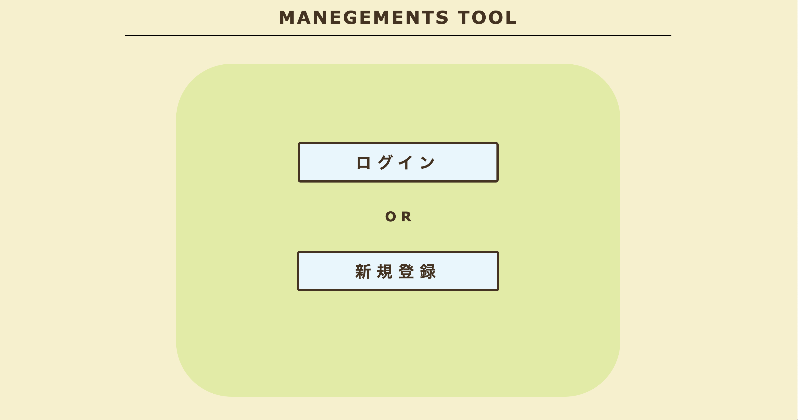
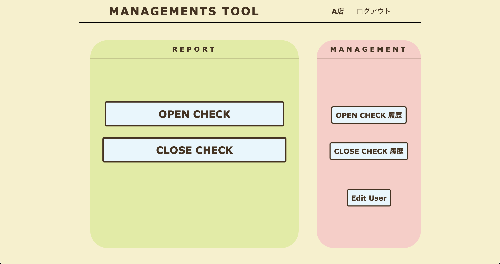
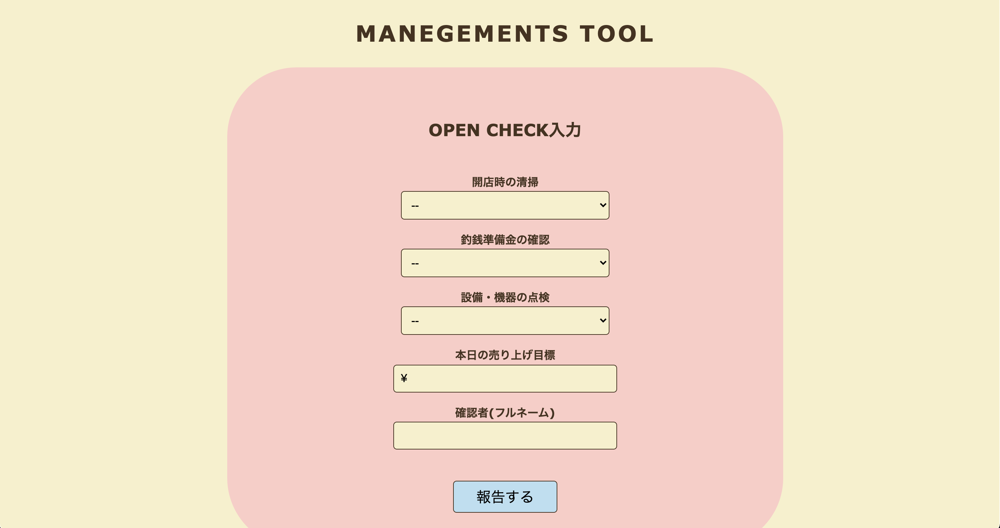
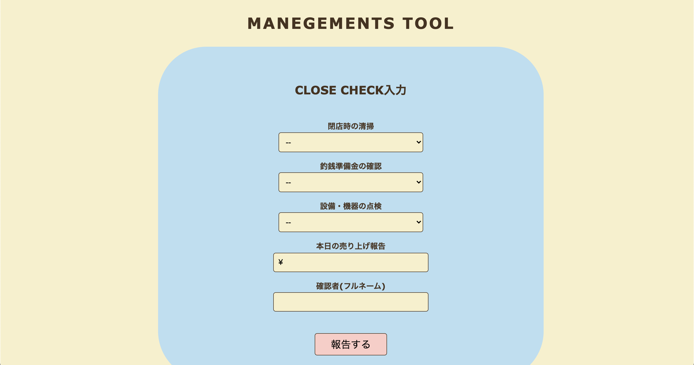
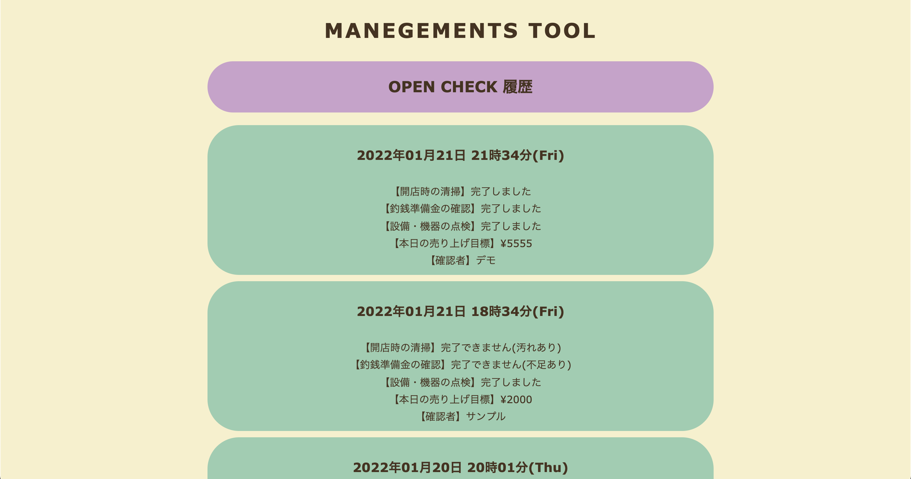
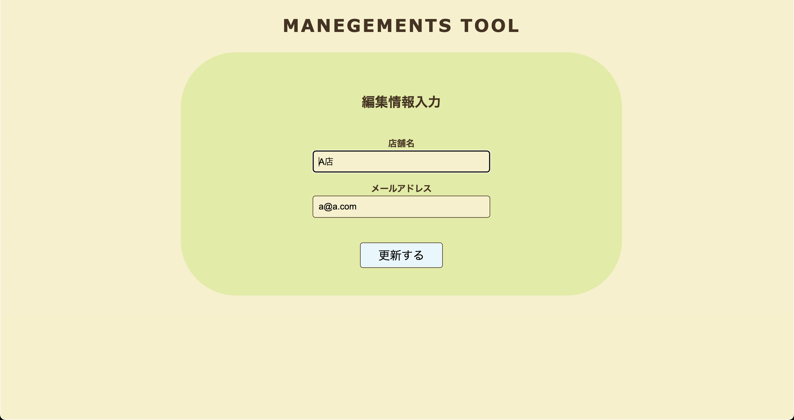

# アプリ名
MANAGEMENTS TOOL
# 概要
飲食店の開店時・閉店時のチェックを行う事ができます。
チェック済みの履歴の確認も可能です。

# 本番環境
https://managements-tool.herokuapp.com/

## ログイン情報(テスト用)

・メールアドレス: a@a.com 
・パスワード    : poi123

### ユーザー認証
・ユーザー名: admin 
・パスワード: 2222

# 製作背景(意図)
飲食店で店舗の運営・管理を行なっている自身の経験からヒントを得て製作致しました。 
初め、オープンチェックやクローズチェックは紙で行なっていましたが、ある時、業務管理を行う事ができるツールが導入されました。
 しかし、そのツールには老若男女が利用しやすいデザインや親しみやすい操作性が備わっておらず、様々な国籍・性別・年齢の方が勤務する飲食店には相応しく有りませんでした。 
 また、自店では正社員２人・アルバイト１０人程が在籍しており、そのツールの機能等の説明を正社員からアルバイトに、都度細かく説明をしていくことは非常に効率が悪いと感じました。 
その様な経験から『誰でも親しみやすいデザイン』『教育・説明に時間がかからない最低限の機能』に重きを置き、このアプリを製作致しました。

# DEMO
### ・トップ画面①(未ログイン時)

各ボタンよりログイン、新規登録ができます。『誰でも親しみやすいデザイン』という観点からボタンを大きくしています。

### ・トップ画面②(ログイン時)

ログイン状態での表示になります。 
まずボタンが５つ有り、左右で報告用・管理用と分かれています。 
左側の報告用ボタンを押すと、上から「開店チェック」と「閉店チェック」を行うページへ遷移されます。 
右側の管理用ボタンを押すと、上から「開店チェックの履歴」「閉店チェックの履歴」「店舗(ユーザー)情報の編集」を行う画面へ遷移されます。 
また、ログインしている店舗名が画面上部に表示されます。

### ・オープンチェック画面

オープンチェックを行うページになります。 
各項目の入力・プルダウンメニューからの選択を行い、画面下部の報告ボタンを押すと登録内容を保存し、トップページへ遷移されます。 
また、画面上部の"MANAGEMENTS TOOL"ボタンを押すとトップページへ戻る事ができます。

### ・クローズチェック画面

クローズチェックを行うページになります。
機能は上記のオープンチェックと同様になります。

### ・オープンチェック履歴確認画面

オープンチェックを行った履歴を確認できるページになります。
履歴は降順に表示されます。 画面上部の"MANAGEMENTS TOOL"ボタンを押すとトップページへ戻る事ができます。

### ・クローズチェック履歴確認ページ

クローズチェックを行なった履歴を確認できるページになります。
機能等は上記のオープンチェック履歴確認ページと同様になります。

### ・店舗(ユーザー)情報編集ページ

登録した店舗情報の「店舗名」「アドレス」を編集する事ができるページになります。

# 工夫したポイント
・相性の良いカラーコードを調べ、清潔感と柔らかさのある見た目を意識しました。 
・様々な方が利用しやすい様に文字の大きさやボタンを大きくし、操作を行いやすくしました。 

# 使用技術(開発環境)
### バックエンド
Ruby / Ruby on Rails
### フロントエンド
Html / CSS /
### データベース
MySQL / SequelPro
### ソース管理
GitHub / GitHubDeskTop
### エディタ
VS Code

# 課題・今後実装したい機能
・オープンチェック・クローズチェックは１日１度のみ要求したいので、登録後は遷移されないようしたい。 
・カレンダーページの実装。カレンダーにはオープンチェック・クローズチェックを行ったかが分かるように履歴を反映させたい。
 
 
 
# テーブル設計

## users テーブル

| Column             | Type   | Option                    |
| ------------------ | ------ | ------------------------- |
| name               | string | null: false               |
| email              | string | null: false, unique: true |
| id                 | string | null: false               |
| encrypted_password | string | null: false               |

### Association

- has_many :task_opens
- has_many :task_closes

## task_opens テーブル

| Column       | Type       | Option                         |
| ------------ | ---------- | ------------------------------ |
| clean_id     | string     | null: false                    |
| money_id     | integer    | null: false                    |
| trouble_id   | integer    | null: false                    |
| sales_target | string     | null: false                    |
| checker      | string     | null: false                    |
| user         | references | null: false, foreign_key :true |

### Association

- belongs_to :user

## task_closes テーブル

| Column       | Type       | Option                         |
| ------------ | ---------- | ------------------------------ |
| clean_id     | string     | null: false                    |
| money_id     | integer    | null: false                    |
| trouble_id   | integer    | null: false                    |
| sales_result | string     | null: false                    |
| checker      | string     | null: false                    |
| user         | references | null: false, foreign_key :true |

### Association

- belongs_to :user
